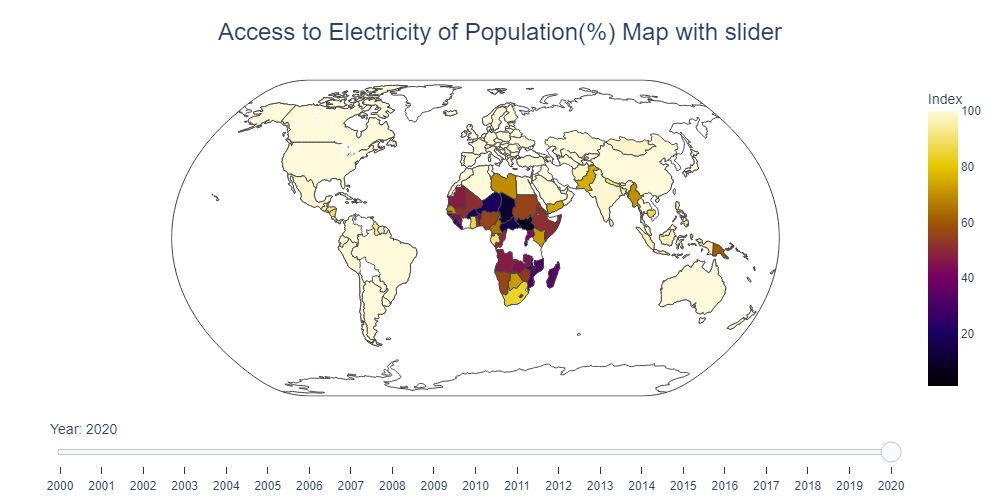
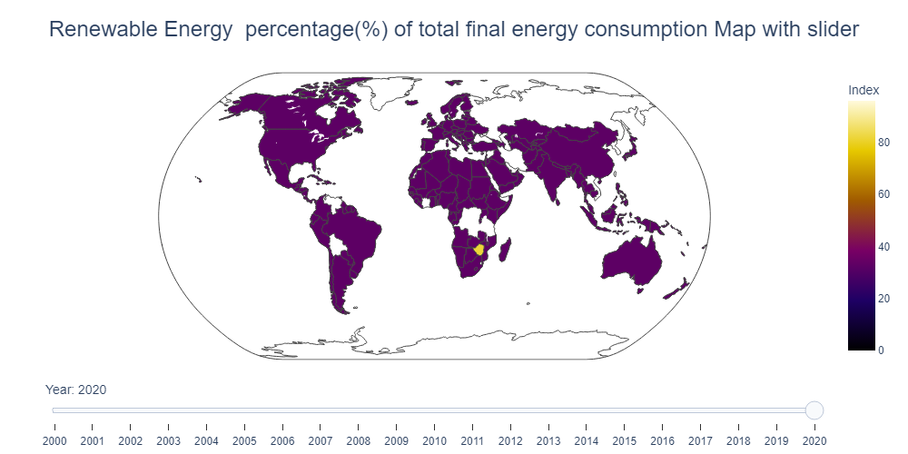

# Global Data on Sustainable Energy (2000-2020)
https://www.kaggle.com/datasets/anshtanwar/global-data-on-sustainable-energy/data

This comprehensive dataset showcasing sustainable energy indicators and other useful factors across all countries from 2000 to 2020

## Questions

1. Access to Electricity of Population(%) (By Country with Map Slider)

2. Renewable Energy  percentage(%) of total final energy consumption (By Country with Map Slider)

3. Top 10 Countries electricity supply from fossil, nuclear and renewable energy

4. Top 10 Countries electricity supply from renewable energy

5. Top 10 Countries with most CO2 Emissions

6. Compare Electricity production from fossil and renewable sources (By Year)

7. CO2 Emission and Per Person Health Expense(USD)

8. How Forest is decreasing from the year 2000 to 2020

## Visual Presentation
PPT

[ppt](visual_presentation.pptx)

## Summary and conclusions

After concluded the project I am very much excited to share rich insights and exploration of data on global sustainable energy. In addition, happy to share that I included few more data got through API of World Bank. It makes the original data richer and provides different dimensions to think.

From the beginning of the project handle the data very carefully. Follow all the processes cleaning, wrangling, EDA, visual report,processing data, model train, test and prediction test score.

## The significant findings are:

1. Electricity access to population in every country are increases year by year

2. Countries are successful to supply more renewable energy to their national grid. Hence, Percentage of energy supply increases year by year all over the world but at the begining Middle african countries are pioneer 

3. The developed or wester world produces largest amount of electricity from all sources

4. The more developed countries emit more CO2 in the environment though they produce significant electricity 
from natural resources. ex: China, USA etc.

5. Per person health expenses are gradually increases while CO2 emissions also gradually increases except in the
year 2020 

6. Global energy has an impact on forest. Its decreases from 2000 to 2020

7. Few features in the data are closely correlated to each other. Findings those through the correlation matrix

8. Used three Machine Learning algorithms for two sets of targets and features to find out a appropriate model. For both cases Random Forest algorithm performs very well for targets 'primary_energy_consumption_per_capita_kwh_person' and 'value_co2_emissions_kt_by_country' value of 0.885764 and 0.995015  respectively.

In essence I can say that any stack holder uses this model to find out predictive result of one or both of the two targets
to make a business decision. In addition s/he considers the visual reports which are enclosed in this notebook. I included 
an interface developed by streamlit python package to predict 'value_co2_emissions_kt_by_country' by giving input in the 
input field. To run this app in local machine please follow the following steps:
 
       1. Go to the folder 'app'

       2. run command 'streamlit run your_app.py'

       3. you see the home page with the address 			 'http://localhost:8501/'

       4. Select 'Prediction' menu item from left menu bar

       5. Now you will see a form. Input values

       6. Press button 'Get Your Prediction' to get the prediction of CO2 emissions for a year
